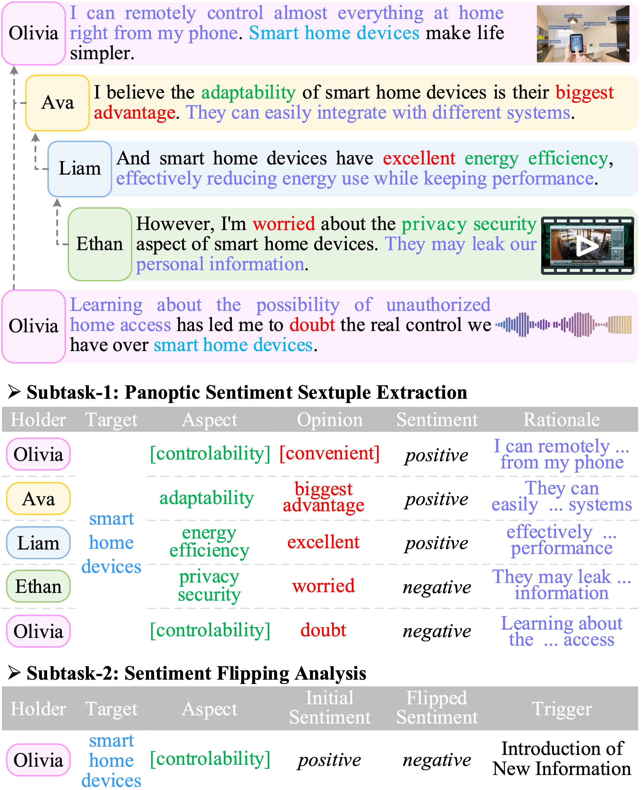
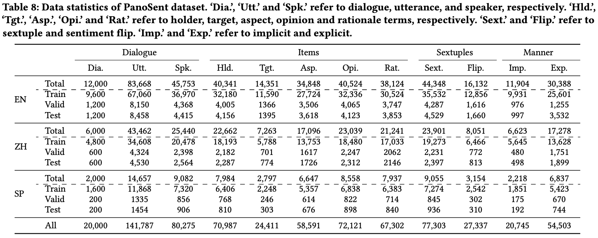
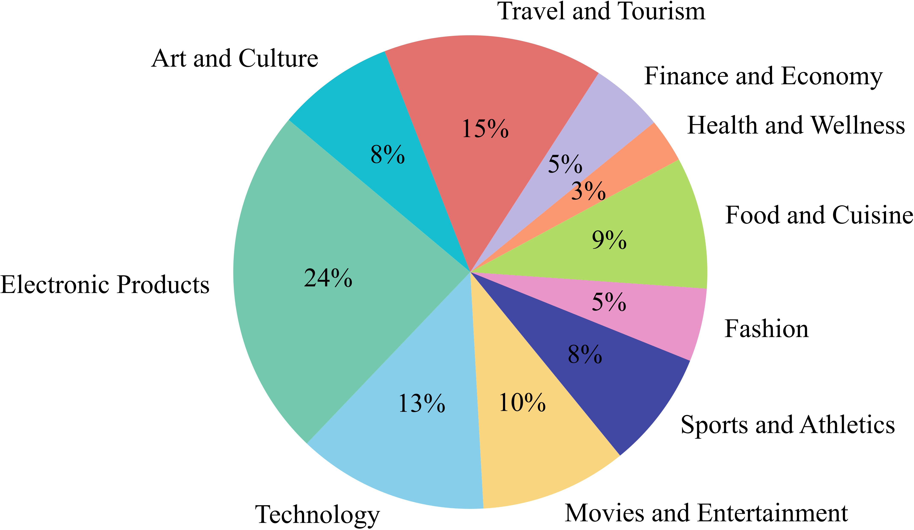

## :revolving_hearts::telescope: PanoSent: A Panoptic Sextuple Extraction Benchmark for Multimodal Conversational Aspect-based Sentiment Analysis
<a href="https://github.com/Eurekaleo/PanoSent">
  
</a>
<a href="https://github.com/Eurekaleo/PanoSent" rel="nofollow">
  
</a>

**The implementation of the ACM MM 2024 paper [PanoSent: A Panoptic Sextuple Extraction Benchmark for Multimodal Conversational Aspect-based Sentiment Analysis](https://is.gd/xxxx)**

----------
 ### 🎉 Visit the project page: [PanoSent](https://eurekaleo.github.io/PanoSent/)

----------


## Overview<a name="overview" />

In summary, this work makes three significant contributions:

> For the first time, we thoroughly upgrade ABSA with a more comprehensive definition at the cognitive level, Multimodal Conversational Aspect-based Sentiment Analysis, introducing Panoptic Sentiment Sextuple Extraction and Sentiment Flipping Analysis tasks, achieving the ultimate form of sentiment analysis within the community.

<p align="center">
  
</p>

> We contribute a large-scale, high-quality benchmark dataset, PanoSent, featuring multiple aspects: conversational contexts, multimodality, multilingualism, and multidomain.

<p align="center">
  
  
</p>

> We propose an advanced reasoning framework, the Chain-of-Sentiment, based on our Sentica MLLM, achieving high task performance and providing a strong baseline for subsequent research on PanoSent.

<p align="center">
  
</p>

----------
## Code 

(TBD)

----------
## Citation

If you use this work, please kindly cite:

```
(TBD)
```

----------
### License

The code is released under Apache License 2.0 for Noncommercial use only. 


----------

